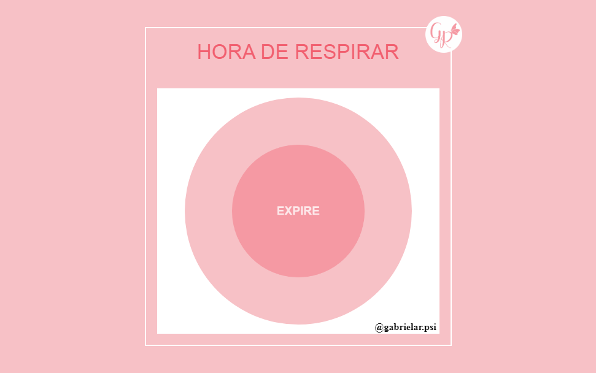

<p align="center">	
	<h1 align="center">Hora de respirar</h1>
</p>
<p align="center">
    
</p>
    <p align="center"><em>Um aplicativo para controlar a ansiedade.</em></p>
    <p align="center">
        
        
  	</p>
</p>

<p align="center">
	
</p>

## Começando :heavy_check_mark:

Essas instruções fornecerão uma cópia do projeto em execução na sua máquina local.

### Instalando :inbox_tray:

Siga passo a passo as seguinte formas de obter o código na sua máquina local.

#### Clonando o repositório

Inicie o repositorio na sua máquina local utilizando as linhas de comando.

```
#Clonar com SSH

mkdir hora-de-respirar
cd hora-de-respirar
git init
git clone git@github.com:JefersonLucas/hora-de-respirar.git
```

```
#Clonar com HTTPS

mkdir hora-de-respirar
cd hora-de-respirar
git init
git clone https://github.com/JefersonLucas/hora-de-respirar.git
```
Agora os arquivos que estão no repositório remoto estão clonados no repositório local.

#### Baixando o repositório

Você também pode [baixar](https://github.com/JefersonLucas/hora-de-respirar/archive/master.zip) o repositório em formato zip.

## Ambiente :desktop_computer:

Veja aqui o a página do projeto implantado por @github-pages [ver implantação](https://jefersonlucas.github.io/hora-de-respirar/).

## Versionamento :label:

Usamos o [SemVer](https://semver.org/lang/pt-BR/) para controle de versão. Para as versões disponíveis, consulte as [tags nesse repositório](https://github.com/JefersonLucas/hora-de-respirar/tags). 

## Autores :pray:

* **Jeferson Lucas** - *Trabalho Inicial* - [JefersonLucas](https://github.com/JefersonLucas).

Veja também a lista de [contribuidores](https://github.com/JefersonLucas/hora-de-respirar/contributors) que participaram deste projeto.

## Licença :copyright:

Este projeto está licenciado sob a licença MIT - consulte o arquivo [LICENSE.md](https://github.com/JefersonLucas/hora-de-respirar/blob/master/LICENSE) para obter detalhes.

## Agradecimentos :clap:

Meus sinceros agradecimentos:

* Primeiramente a Deus. 
* Meus sinceros agradecimentos a todos que visitam o projeto e deixa uma estrela como reconhecimento.
